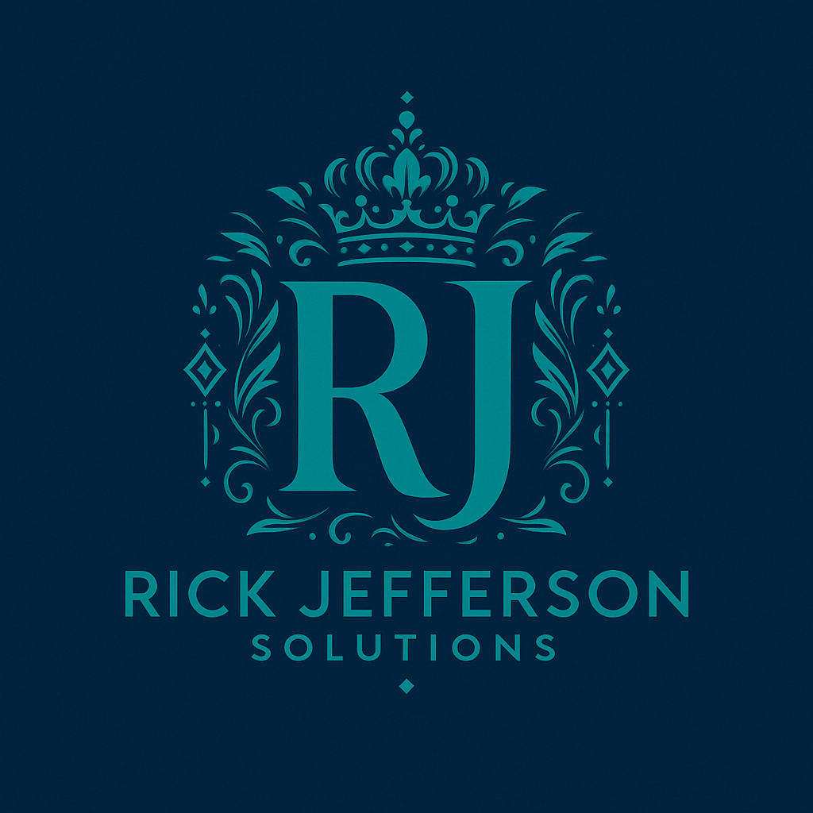

# 🎨 Rick Jefferson Solutions - Branding Assets

---

**🏢 Rick Jefferson Solutions** | *Enterprise AI Solutions & Legal Technology Innovation*  
📞 **Support**: [945-308-8003](tel:945-308-8003) | 📧 **Email**: [support@rjbizsolution.com](mailto:support@rjbizsolution.com)

---

## 🖼️ Brand Assets

### Company Logo
- **File**: `assets/rick-solutions-logo.png`
- **Format**: PNG
- **Usage**: Primary company branding, headers, documentation
- **Size**: High resolution (1187KB)
- **Colors**: Rick Jefferson Solutions brand colors

### Professional Headshot
- **File**: `assets/rick-headshot.webp`
- **Format**: WebP
- **Usage**: About sections, team pages, professional profiles
- **Size**: Optimized (37KB)
- **Style**: Professional business headshot

## 🎨 Brand Guidelines

### Color Palette
```css
/* Primary Colors */
--rjs-teal: #008080;
--rjs-teal-light: #20B2AA;
--rjs-navy: #000080;
--rjs-navy-light: #1E3A8A;

/* Accent Colors */
--rjs-white: #FFFFFF;
--rjs-success: #10B981;
--rjs-warning: #F59E0B;
--rjs-error: #EF4444;
```

### Typography
- **Primary Font**: Inter Tight
- **Secondary Font**: System fonts (San Francisco, Segoe UI)
- **Code Font**: JetBrains Mono, Monaco, Consolas

### Logo Usage Guidelines

#### ✅ Correct Usage
- Use original logo without modifications
- Maintain proper spacing around logo
- Use on contrasting backgrounds
- Scale proportionally
- Use high-resolution versions for print

#### ❌ Incorrect Usage
- Don't stretch or distort the logo
- Don't change colors without approval
- Don't use on busy backgrounds
- Don't add effects or filters
- Don't use low-resolution versions

## 📱 Digital Applications

### Website Headers
```html
<!-- Primary Logo Usage -->

```

### Social Media
- **Profile Picture**: Use headshot (`rick-headshot.webp`)
- **Cover/Banner**: Use logo with brand colors
- **Posts**: Maintain consistent branding

### Documentation
- Use logo in README headers
- Include headshot in About sections
- Maintain brand color consistency

## 🎯 Brand Voice & Messaging

### Key Messages
- **Expertise**: "World's top Credit Repair Attorney Agent"
- **Innovation**: "Transforming Legal Technology with AI"
- **Enterprise**: "Enterprise AI Solutions & Legal Technology Innovation"
- **Support**: "Direct expert support at 945-308-8003"

### Tone of Voice
- **Professional**: Enterprise-grade solutions
- **Innovative**: Cutting-edge AI technology
- **Accessible**: Direct support and communication
- **Authoritative**: Legal expertise and compliance

## 📞 Contact Information

### Primary Contact
- **Phone**: [945-308-8003](tel:945-308-8003)
- **Email**: [support@rjbizsolution.com](mailto:support@rjbizsolution.com)
- **Website**: [https://rjbizsolution.com](https://rjbizsolution.com)

### Professional Profiles
- **LinkedIn**: Rick Jefferson, Legal Technology Expert
- **GitHub**: [@rickjefferson](https://github.com/rickjefferson)
- **Company**: Rick Jefferson Solutions

## 🚀 Implementation Checklist

### Repository Branding
- ✅ Logo downloaded (`rick-solutions-logo.png`)
- ✅ Headshot downloaded (`rick-headshot.webp`)
- ✅ Brand colors implemented
- ✅ Contact information updated
- ✅ Professional messaging applied

### GitHub Repository
- ✅ README with logo and branding
- ✅ Issue templates with contact info
- ✅ PR templates with branding
- ✅ CI/CD with brand identity
- ✅ Documentation with assets

### Extension Package
- ✅ Custom icon with brand colors
- ✅ Branded UI components
- ✅ Professional contact information
- ✅ Enterprise positioning

## 📊 Brand Assets Inventory

| Asset | File | Size | Format | Usage |
|-------|------|------|--------|---------|
| Company Logo | `rick-solutions-logo.png` | 1187KB | PNG | Primary branding |
| Professional Headshot | `rick-headshot.webp` | 37KB | WebP | Personal branding |
| Extension Icon | `assets/icon.svg` | Vector | SVG | VS Code extension |
| Extension Icon | `assets/icon.png` | Raster | PNG | Fallback icon |

## 🎨 Design System

### Components
- Headers with logo placement
- Contact information blocks
- Professional color schemes
- Consistent typography
- Brand-aligned iconography

### Templates
- Documentation headers
- Email signatures
- Social media posts
- Presentation slides
- Business cards

## 🔒 Brand Protection

### Usage Rights
- Internal use: Unlimited
- Partner use: With approval
- Third-party use: Requires permission
- Modifications: Brand team approval required

### Quality Control
- Regular brand audits
- Consistent application
- Professional standards
- Legal compliance

---

**🏢 Rick Jefferson Solutions** - *Transforming Legal Technology with AI Innovation*

*"Professional branding that reflects enterprise excellence and legal expertise."*

**📞 Ready to elevate your brand presence? Call [945-308-8003](tel:945-308-8003) today!**

---