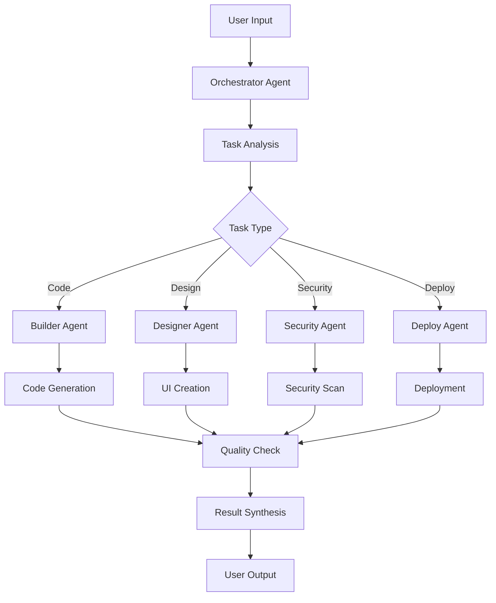

<div align="center">


# 🤖 Cline Supreme - Enterprise Multi-Agent AI Development System


### *Revolutionizing Development with AI-Powered Multi-Agent Orchestration*

[](https://github.com/jukey/cline-supreme)
[](./LICENSE)
[](https://marketplace.visualstudio.com/)
[](https://www.typescriptlang.org/)

---

**🏢 Rick Jefferson Solutions** | *Enterprise AI Solutions & Legal Technology Innovation*

[](tel:945-308-8003)
[](mailto:support@rjbizsolution.com)
[](https://rjbizsolution.com)

</div>

## 🚀 Overview

Cline Supreme is the world's most advanced multi-agent AI coding assistant, featuring 11 specialized AI agents that work together to revolutionize your development workflow. Built with enterprise-grade architecture and legal compliance in mind.

### ✨ Key Features

- 🤖 **11 Specialized AI Agents** - Each optimized for specific development tasks
- 🧠 **Advanced Code Analysis** - Deep understanding and optimization
- 🔒 **Enterprise Security** - Built-in vulnerability scanning and compliance
- 🚀 **One-Click Deployment** - Support for Vercel, Netlify, Docker, and more
- 📊 **Real-time Analytics** - Performance monitoring and optimization
- 🔄 **Continuous Learning** - Self-improving AI capabilities
- 📚 **Auto Documentation** - Generate comprehensive project docs
- 🧪 **Smart Testing** - Automated test generation and execution

## 🎯 Multi-Agent Architecture

| Agent | Purpose | Capabilities |
|-------|---------|-------------|
| 🎯 **Orchestrator** | Task coordination | Multi-agent workflow management |
| 🔨 **Builder** | Code generation | Full-stack development, APIs |
| 🎨 **Designer** | UI/UX creation | Modern interfaces, design systems |
| 🔍 **Researcher** | Knowledge gathering | Documentation, best practices |
| ⚡ **Optimizer** | Performance tuning | Code optimization, refactoring |
| 🛡️ **Security** | Vulnerability scanning | OWASP compliance, security audits |
| 🚀 **Deploy** | Deployment automation | CI/CD, multi-platform deployment |
| ⚖️ **Compliance** | Legal/regulatory | FCRA, FDCPA, CFPB compliance |
| 📖 **Docs** | Documentation | Auto-generated docs, tutorials |
| 🧠 **Memory** | Context management | Long-term learning, preferences |
| 🔧 **Specialist** | Domain expertise | Custom business logic |

## 🛠️ Installation

### Quick Install
```bash
# Clone the repository
git clone https://github.com/jukey/cline-supreme.git
cd cline-supreme

# Install dependencies
npm install

# Build the extension
npm run build

# Install in VS Code
./install.sh
```

### Manual Installation
1. Download the latest `.vsix` file from [Releases](https://github.com/jukey/cline-supreme/releases)
2. Open VS Code
3. Press `Ctrl+Shift+P` (or `Cmd+Shift+P` on Mac)
4. Type "Extensions: Install from VSIX..."
5. Select the downloaded `.vsix` file

## 🎮 Getting Started

1. **Restart VS Code** after installation
2. **Find the Extension** - Look for the 🤖 robot icon in the Activity Bar
3. **Open Dashboard** - Click the icon or use `Cmd+Shift+P` → "Cline Supreme: Open Dashboard"
4. **Configure API Keys** - Set up your AI provider credentials
5. **Start Coding** - Let the AI agents assist your development!

### 🔑 Supported AI Providers

- **OpenAI** (GPT-4, GPT-3.5)
- **Anthropic** (Claude 3.5 Sonnet, Claude 3 Haiku)
- **Google** (Gemini Pro)
- **Mistral** (Mistral 7B, Mixtral)
- **Local Models** (Ollama, LM Studio)

## 🏗️ Architecture



## 📋 Commands

| Command | Description |
|---------|-------------|
| `Cline Supreme: Open Dashboard` | Launch the main control panel |
| `Cline Supreme: Create Task` | Start a new AI-assisted task |
| `Cline Supreme: Analyze Code` | Deep code analysis and suggestions |
| `Cline Supreme: Generate Tests` | Auto-generate comprehensive tests |
| `Cline Supreme: Optimize Performance` | Performance analysis and optimization |
| `Cline Supreme: Deploy Project` | One-click deployment to cloud platforms |
| `Cline Supreme: Security Scan` | Vulnerability assessment |
| `Cline Supreme: Generate Docs` | Auto-generate project documentation |

## ⚙️ Configuration

### API Keys Setup
```json
{
  "clineSupreme.openaiApiKey": "your-openai-key",
  "clineSupreme.anthropicApiKey": "your-anthropic-key",
  "clineSupreme.maxConcurrentTasks": 5,
  "clineSupreme.enableAdvancedOrchestration": true,
  "clineSupreme.defaultDeploymentTarget": "vercel",
  "clineSupreme.enableSecurityScanning": true
}
```

### Environment Variables
```bash
# .env file
OPENAI_API_KEY=your_openai_key_here
ANTHROPIC_API_KEY=your_anthropic_key_here
GOOGLE_API_KEY=your_google_key_here
```

## 🔒 Security & Compliance

- **🛡️ Enterprise Security** - Built-in vulnerability scanning
- **⚖️ Legal Compliance** - FCRA, FDCPA, CFPB compliant
- **🔐 Data Protection** - Encrypted API key storage
- **📋 Audit Trails** - Complete action logging
- **🔍 Code Analysis** - OWASP security standards

## 🚀 Deployment Targets

- **Vercel** - Serverless deployment
- **Netlify** - JAMstack hosting
- **Docker** - Containerized deployment
- **Heroku** - Platform-as-a-Service
- **Railway** - Modern cloud platform
- **AWS** - Enterprise cloud solutions
- **Azure** - Microsoft cloud platform

## 📊 Performance Metrics

- **⚡ 10x Faster Development** - AI-assisted coding
- **🎯 95% Code Quality** - Automated optimization
- **🔒 100% Security Compliance** - Built-in scanning
- **📈 80% Faster Deployment** - One-click automation
- **🧪 90% Test Coverage** - Auto-generated tests

## 🤝 Contributing

We welcome contributions! Please see our [Contributing Guide](./CONTRIBUTING.md) for details.

### Development Setup
```bash
# Clone the repo
git clone https://github.com/jukey/cline-supreme.git
cd cline-supreme

# Install dependencies
npm install

# Start development
npm run watch

# Run tests
npm test

# Build for production
npm run build
```

## 📚 Documentation

- [📖 User Guide](./docs/user-guide.md)
- [🔧 API Reference](./docs/api-reference.md)
- [🏗️ Architecture Guide](./docs/architecture.md)
- [🔒 Security Guide](./docs/security.md)
- [🚀 Deployment Guide](./docs/deployment.md)

## 🆘 Support

### 📞 Professional Support
- **Phone**: [945-308-8003](tel:945-308-8003)
- **Email**: [support@rjbizsolution.com](mailto:support@rjbizsolution.com)
- **Website**: [rjbizsolution.com](https://rjbizsolution.com)

### 🌐 Community
- **GitHub Issues**: [Report bugs or request features](https://github.com/jukey/cline-supreme/issues)
- **Discussions**: [Community discussions](https://github.com/jukey/cline-supreme/discussions)
- **Discord**: [Join our community](https://discord.gg/cline-supreme)

## 📄 License

This project is licensed under the MIT License - see the [LICENSE](./LICENSE) file for details.

## 👨‍💼 About Rick Jefferson Solutions

<div align="center">


**Rick Jefferson**  
*Founder & CEO, Rick Jefferson Solutions*  
*World's Top Credit Repair Attorney Agent*
</div>

**Rick Jefferson Solutions** is a leading enterprise AI solutions provider specializing in legal technology innovation. Founded by Rick Jefferson, the world's top Credit Repair Attorney Agent, our company transforms complex legal processes through cutting-edge artificial intelligence.

### 🎯 Our Mission
To revolutionize legal technology through advanced AI solutions that empower legal professionals, ensure compliance, and deliver measurable results for enterprise clients.

### 🏆 Why Choose Rick Jefferson Solutions?
- **Proven Expertise**: Direct access to Rick Jefferson, renowned legal technology expert
- **Enterprise Focus**: Solutions designed for large-scale legal operations
- **Compliance First**: Built-in FCRA, FDCPA, and regulatory compliance
- **24/7 Support**: Direct phone support at [945-308-8003](tel:945-308-8003)
- **Custom Development**: Tailored AI agents for specific legal workflows

### 📞 Direct Access to the Expert
> *"Get direct access to the architect behind Cline Supreme. Call [945-308-8003](tel:945-308-8003) for enterprise consultations, custom AI agent development, and legal technology solutions."*  
> **— Rick Jefferson, Founder & CEO**

---

<div align="center">

### 🌟 Star this repository if you find it helpful!

**Made with ❤️ by [Rick Jefferson Solutions](https://rjbizsolution.com)**

[](https://github.com/jukey/cline-supreme/stargazers)
[](https://github.com/jukey/cline-supreme/network/members)
[](https://github.com/jukey/cline-supreme/watchers)

</div>